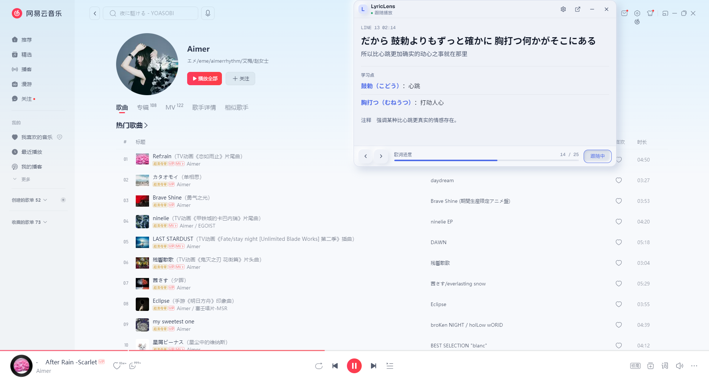
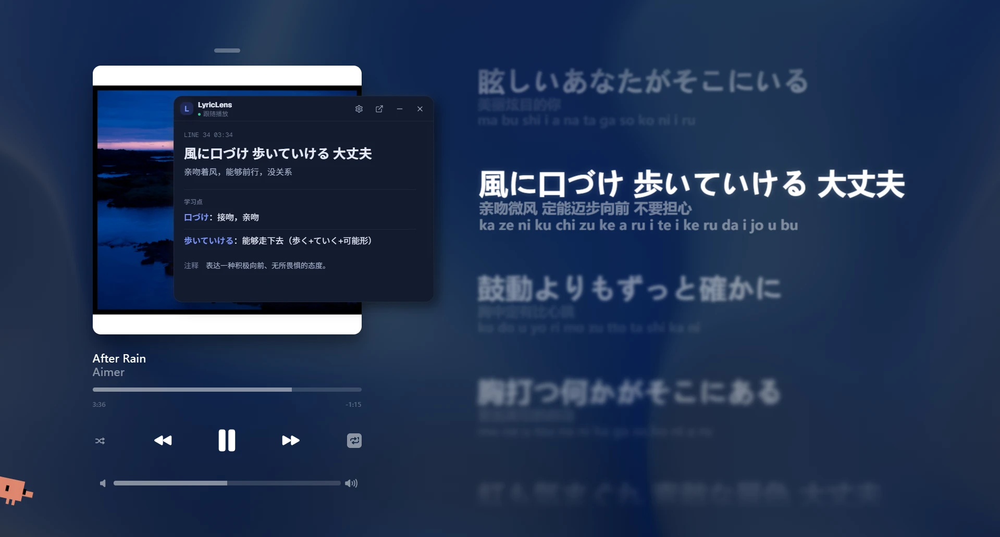
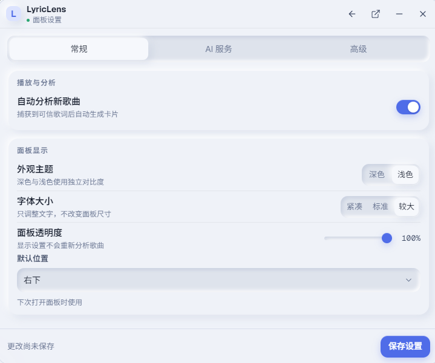

# LyricLens

[中文](README.md) · [English](README.en.md)

BetterNCM AI 歌词学习插件。播放英文/日文歌曲时，读取当前歌词，调用用户配置的 OpenAI 兼容 Chat Completions Endpoint 生成学习卡片，在网易云客户端内显示浮层。当前版本 v0.2，新增插件内一键检查更新，以及直接给开发者发反馈邮件的入口。

## 截图

<p align="center">
  
  
  
</p>

## 安装

### 推荐：从插件官网下载

1. 退出网易云音乐。
2. 打开 [lyriclens.yoru-and-akari.dev](https://lyriclens.yoru-and-akari.dev)，点「下载最新版」按钮，得到 `LyricLens.plugin` 文件。
3. 把 `.plugin` 文件拖进 BetterNCM 的「插件管理」窗口，或解压到 BetterNCM 插件目录下的 `plugins/lyriclens/`。
4. 重新打开网易云音乐，在 BetterNCM 插件管理中启用 LyricLens。

### 已经装过：插件内一键更新

打开 LyricLens 浮层 → 齿轮按钮 → 关于 tab → 点「立即更新」按钮即可。下载、安装、提示重启全自动，全程不需要离开网易云。

### 备选：从 GitHub Release

如果上面的渠道都不可用，到 [Releases](https://github.com/yoruuuchan/LyricLens/releases) 页面手动下载最新的 `LyricLens.plugin` 文件，剩下步骤跟上面一样。

### 从源码安装（开发者）

1. 退出网易云音乐。
2. 将本项目整个文件夹复制到 BetterNCM 插件目录，例如 `plugins/lyriclens/`。
3. 确认目录内包含 `manifest.json`、`main.js`、`src/`、`styles/`。
4. 重新打开网易云音乐，在 BetterNCM 插件管理中启用 LyricLens。

本项目不需要构建，源码可直接加载。如需重新打包 `.plugin`：`npm run build`。

## 配置

首次播放英文或日文歌曲且 API 未配置时，浮层会显示配置表单。也可以点击浮层右上角齿轮按钮打开设置。

需要填写：

- API Endpoint：完整 OpenAI 兼容 Chat Completions 地址，例如 `https://api.openai.com/v1/chat/completions`
- API Key：你的服务商密钥
- Model Name：模型名称
- 自动拆解：默认开启
- 浮层默认位置
- 浮层透明度

API Key 只写入本地 BetterNCM 配置，并同步一份到 localStorage 作为 MVP 降级存储；不会上传到插件作者服务器。

## 调试日志

插件会输出以下日志：

- 插件加载成功
- 当前 songId
- 歌词来源和字段探测
- 语言检测结果
- API 请求开始/成功/失败/超时
- PlayProgress 参数探测

查看方式：

- BetterNCM/网易云客户端可用开发者工具时，打开 Console。
- 如果需要打开主进程 Console，可在 BetterNCM 环境执行 `betterncm.app.showConsole(true)`。

### 诊断模式

诊断模式默认关闭。需要真实客户端验证时，在 Console 执行：

```js
localStorage.setItem("ll_debug", "true");
location.reload();
```

关闭诊断模式：

```js
localStorage.removeItem("ll_debug");
location.reload();
```

开启后，Console 会使用统一前缀 `[LyricLens:diagnostics]` 输出：

- BetterNCM / 网易云关键对象是否存在、类型、安全截断样例和错误
- `window.onProcessLyrics` 捕获到的歌词 payload 顶层结构
- 前 5 次及之后每 10 秒一次的 `PlayProgress` 参数结构
- `styles/panel.css` 解析、加载成功或失败状态

浮层内会出现折叠的“诊断”入口，显示当前 `songId`、语言检测结果、歌词来源、卡片数、当前卡片 index、API 状态、最后错误和 CSS 状态。

## 已知限制

- BetterNCM/网易云歌词对象字段需要在真实客户端里继续确认；当前按 `window.currentLyrics`、`window.CPPLYRICS_INTERNALS?.currentLyrics`、`window.AMLL?.currentLyrics`、`window.onProcessLyrics` wrapper、`betterncm.ncm.getPlayingSong()` 字段探测顺序降级。
- 没有 manifest hijack，不主动改写网易云/AMLL/CppLyrics 内部渲染。
- 内存缓存仅本次客户端运行有效。
- MVP 不提供 BetterNCM 原生设置页，先使用浮层齿轮表单。
- API 请求是否可用取决于用户配置的 endpoint、网络和 CORS/客户端 fetch 行为。

## 真实客户端验证记录模板

```md
### LyricLens v0.1 客户端验证记录

- 验证日期：
- 网易云音乐版本：
- BetterNCM/chromatic 版本：
- 操作系统：

#### Runtime Probe

- `window.betterncm`：
- `betterncm.ncm`：
- `betterncm.ncm.getPlaying`：
- `betterncm.ncm.getPlayingSong`：
- `legacyNativeCmder`：
- `window.currentLyrics`：
- `window.CPPLYRICS_INTERNALS?.currentLyrics`：
- `window.AMLL?.currentLyrics`：
- `betterncm.app.readConfig`：
- `betterncm.app.writeConfig`：

#### 返回样例

- `getPlaying` 安全截断样例：
- `getPlayingSong` 安全截断样例：
- 歌词 payload 顶层 keys：
- `lrc/yrc/tlyric/romalrc` 存在情况：
- lyric 字符串长度：
- 前 2 行脱敏/截断样例：
- `PlayProgress` 参数结构：
- `readConfig/writeConfig` 是否可用：
- CSS 加载方式是否可用：

#### 歌曲验证

- 英文歌 songId / 结果：
- 日文歌 songId / 结果：
- 中文歌 songId / 结果：
- API 失败结果：
- 切歌取消请求结果：

#### 已发现问题

-

#### 结论

-
```

## 本地测试

```powershell
npm test
```

测试覆盖语言检测、歌词预处理、缓存 key、LLM JSON 容错解析和播放时间同步等纯逻辑模块。
